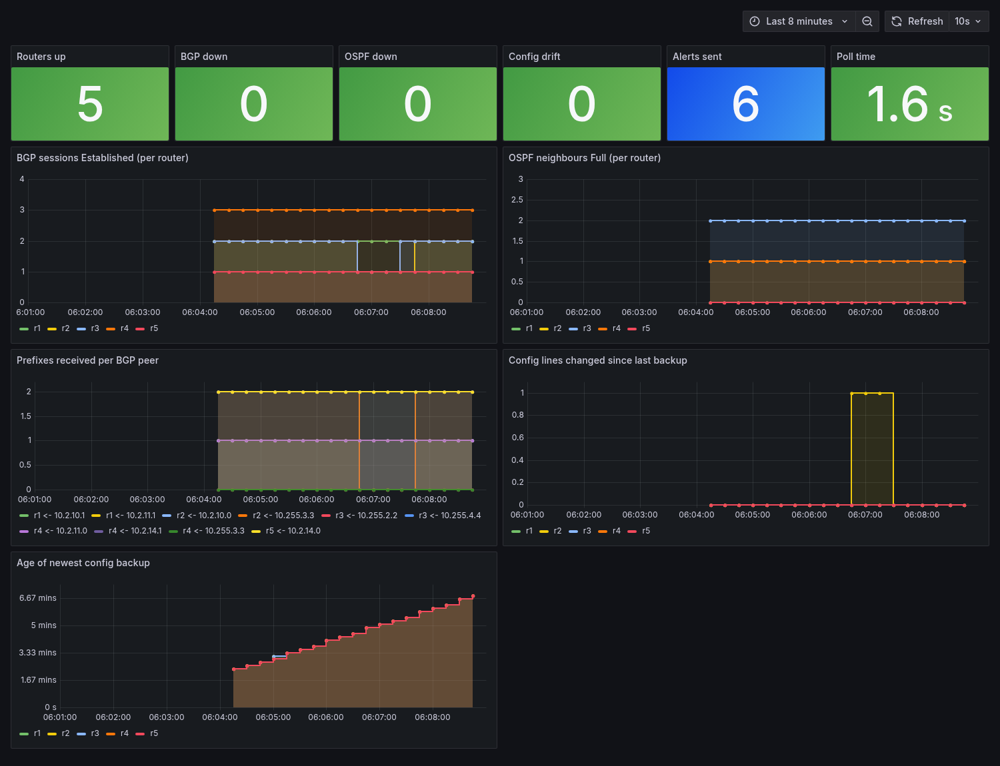

# netops: network automation and monitoring platform


One text file describes a network. This platform turns that file into a running
network, checks every change before it is applied, watches the network once it
is up, and tells you when something breaks or drifts.

It runs on a virtual network (FRRouting routers in Docker, built by
Containerlab), so it is safe to run on a laptop or a home server. Nothing here
touches a real network.



*The dashboard during a test: a BGP session was shut down by hand, the watcher
alerted, the session came back, and the alert resolved.*

## The problem

Companies run many routers, and people change them by hand. That leads to
three common failures:

1. Nobody can say what each router should be running.
2. A typo (duplicate IP, wrong neighbour) reaches production before anyone sees it.
3. A change made at 2 a.m. is never written down, and an outage goes unnoticed.

## What it does

| Step | What happens | Command |
|------|--------------|---------|
| **Describe** | One file, `data/network.yml`, lists devices, cables, addresses, OSPF, BGP and routing policy. | |
| **Validate** | 20+ rules reject a bad change before it reaches a router: duplicate IPs, cables that do not match on both ends, BGP neighbours that exist on only one side, undefined route-maps, iBGP peers that cannot reach each other. | `netops validate` |
| **Generate** | Containerlab topology, per-router configs and the Ansible inventory are all generated from that file. | `netops render` |
| **Deploy** | Ansible pushes each router its full config over SSH. | `make deploy` |
| **Back up** | Every running config is saved in a git repository, so you get a history of changes. | `netops backup` |
| **Detect drift** | Compares each router with the source of truth (missing lines) and with the approved baseline backup (lines added or removed by hand). | `netops drift` |
| **Monitor** | Polls BGP sessions and OSPF neighbours, exposes Prometheus metrics, and draws them in Grafana. | `netops watch` |
| **Alert** | Sends a message when a problem lasts two polls in a row, and another when it recovers. Telegram, or any Discord/Slack-style webhook. | `netops alert-test` |

## The demo network

Five routers: an ISP core (AS 65100, OSPF underlay, iBGP with a route
reflector) and two customers. Customer A has two connections and the ISP
prefers one by local-preference. A prefix-list stops a bogus route from
customer A. Customer B's two small prefixes are aggregated.

```
 AS 65001                  AS 65100 (ISP)                  AS 65002

 r1 ====eBGP==== r2 ---- r3 ---- r4 ====eBGP==== r5
 customer A     edge    (route   edge           customer B
                        reflector)
  \_____________eBGP, second path_____/
```

The routing design is explained lab by lab in
[network-automation-labs](https://github.com/panmanzee/network-automation-labs).
This repo is the platform around it.

## Try it

You need Docker, [Containerlab](https://containerlab.dev) and Ansible.

```bash
python -m venv .venv && .venv/bin/pip install -r requirements-dev.txt
make test          # unit tests, no network needed
make image         # build the router image (generates a local SSH key)
make up            # validate, render, start the virtual network
make deploy        # Ansible pushes the configs
make verify        # BGP and OSPF health
make backup        # save the approved baseline
make drift         # compare running config with the source of truth
make down
```

Monitoring (needs `GRAFANA_PASSWORD` in `.env`, see `.env.example`):

```bash
make watch         # in one terminal: metrics on :9108, alerts
make monitor-up    # Prometheus on :9190, Grafana on :3300 (localhost only)
```

`make e2e` does everything in one go and proves the features against the live
network. CI runs the same script on every push.

## What the end-to-end test proves

```
== 1. health: every BGP session and OSPF neighbour comes up
== 2. backup: configs saved as git history
== 3. drift: a clean network has none
== 4. drift: someone changes a router by hand -> detected
   r3   DRIFT
        added since last backup:    interface eth1 | ip ospf cost 500
== 5. revert the manual change -> clean again
== 6. alerting: break a BGP session -> ALERT, fix it -> RESOLVED
   ALERT sent: ALERT: r2: only 1/2 BGP sessions are Established
   RESOLVED sent: RESOLVED: r3: only 1/2 BGP sessions are Established
```

## Layout

```
data/network.yml         the source of truth
netops/model.py          data model and validation rules
netops/render.py         topology, router configs and inventory generation
netops/backup.py         config backups (git) and drift detection
netops/confparse.py      config comparison that ignores order and comments
netops/health.py         reads BGP/OSPF state from the routers
netops/alert.py          debounced alerts (Telegram / webhook / log)
netops/watch.py          the watcher and its Prometheus metrics
ansible/deploy.yml       pushes the generated configs
monitoring/              Prometheus + Grafana, dashboard generated as code
scripts/e2e.sh           end-to-end proof against the live network
tests/                   59 unit tests
```

## Limits

- The routers are virtual. The platform talks to them over SSH and `vtysh`, as
  it would with real FRR-based devices. Support for other vendors would need a
  new driver in `netops/device.py` and a new config template.
- Alert delivery is tested against a local stub server. Telegram and webhook
  senders are implemented but have not been tried with a real chat account.
- The baseline backup is taken on demand (`netops backup`), not on a schedule.
- The source of truth is a YAML file in git. A database such as NetBox could
  replace it behind the same model.
